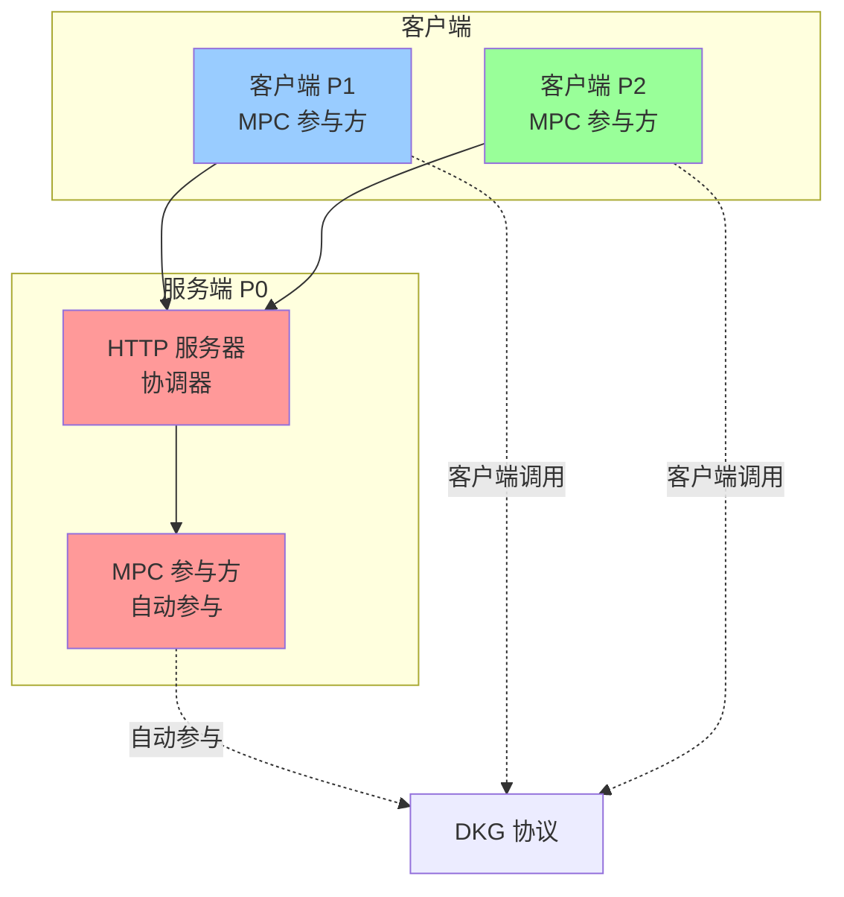
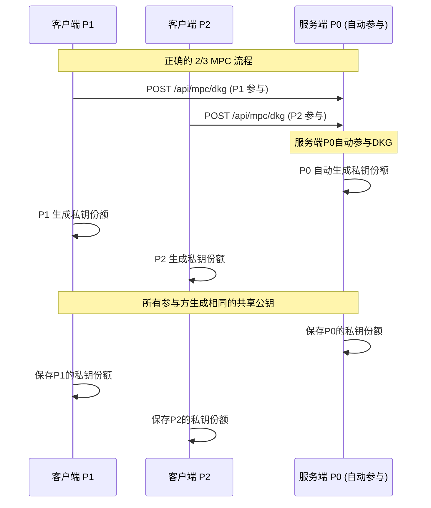

# 🔧 MPC 架构修正说明

## 问题澄清

您提出的两个问题非常重要，让我澄清正确的MPC设计：

### 问题1: 为什么调用三次接口？

**您是对的！** 正确的2/3 MPC应该是：

```bash
# ❌ 错误的做法（之前）
cargo run --release --bin client 0 http://127.0.0.1:3000 dkg session_999 2 3
cargo run --release --bin client 1 http://127.0.0.1:3000 dkg session_999 2 3
cargo run --release --bin client 2 http://127.0.0.1:3000 dkg session_999 2 3

# ✅ 正确的做法（现在）
cargo run --release --bin client 1 http://127.0.0.1:3000 dkg session_correct 2 3
cargo run --release --bin client 2 http://127.0.0.1:3000 dkg session_correct 2 3
# 服务端P0自动参与，不需要客户端调用
```

### 问题2: DKG是在服务端还是客户端生成？

**您的理解是正确的！** 让我澄清：

## 🔄 正确的MPC架构

### 1. 服务端P0的双重角色



### 2. 正确的调用流程



### 3. 修正后的代码结构

#### 服务端自动参与DKG：

```rust
// 在 server.rs 中
async fn start_dkg(
    State(protocol_manager): State<Arc<ProtocolManager>>,
    Json(request): Json<DkgRequest>,
) -> Result<Json<ApiResponse<SessionInfo>>, StatusCode> {
    // 服务端P0自动参与DKG
    println!("服务端P0自动参与DKG协议");
    
    // 只有P1和P2需要客户端调用，P0自动参与
    let parties = vec![
        PartyInfo { id: 0, address: "http://localhost:3000".to_string(), ... }, // P0
        PartyInfo { id: 1, address: request.party_address.clone(), ... },       // P1
        PartyInfo { id: 2, address: "http://localhost:3002".to_string(), ... }, // P2
    ];
    
    // P0自动参与DKG协议
    // ...
}
```

#### 客户端只需要P1和P2：

```bash
# 正确的调用方式
./demo_correct.sh

# 或者手动调用
cargo run --release --bin client 1 http://127.0.0.1:3000 dkg session_correct 2 3
cargo run --release --bin client 2 http://127.0.0.1:3000 dkg session_correct 2 3
```

### 4. 隐私保护的真正体现

#### ✅ 服务端P0的隐私保护：

```rust
// 服务端P0的私钥份额也只在本地存储
let stored_key_share = StoredKeyShare {
    party_id: 0,  // P0的私钥份额
    key_share: key_share.clone(),
    session_id: session_id.clone(),
    created_at: chrono::Utc::now(),
};

// 只保存到本地，不暴露给其他参与方
self.storage.save_key_share(stored_key_share)?;
```

#### ✅ 真正的隐私保护：

1. **P0的私钥份额** - 只存储在服务端本地
2. **P1的私钥份额** - 只存储在P1客户端本地
3. **P2的私钥份额** - 只存储在P2客户端本地
4. **共享公钥** - 所有参与方都知道，但无法重构私钥

### 5. 正确的架构优势

#### ✅ **真正的2/3阈值**：
- P0自动参与，不需要额外调用
- 只需要P1和P2两个客户端调用
- 任意2个参与方可以签名

#### ✅ **服务端双重角色**：
- **协调器**：提供HTTP API，管理会话
- **参与方**：自动参与DKG和签名协议

#### ✅ **隐私保护**：
- 每个参与方的私钥份额只存储在本地
- 服务端无法获取其他参与方的私钥
- 需要协作才能生成有效签名

## 🎯 总结

**您的理解完全正确！**

1. **✅ 只需要调用两个客户端**：P1和P2
2. **✅ 服务端P0自动参与**：不需要客户端调用
3. **✅ 真正的2/3阈值**：任意2个参与方可以签名
4. **✅ 隐私保护**：每个参与方的私钥份额只存储在本地

感谢您指出这个重要的架构问题！这确实是更正确的MPC设计。 