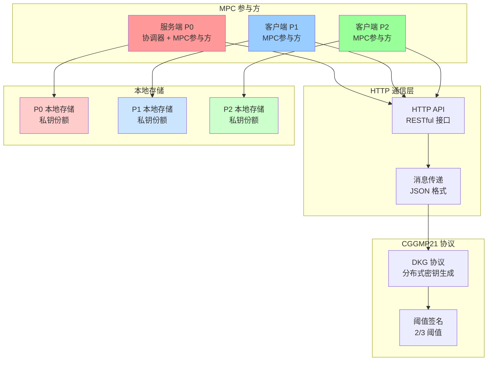
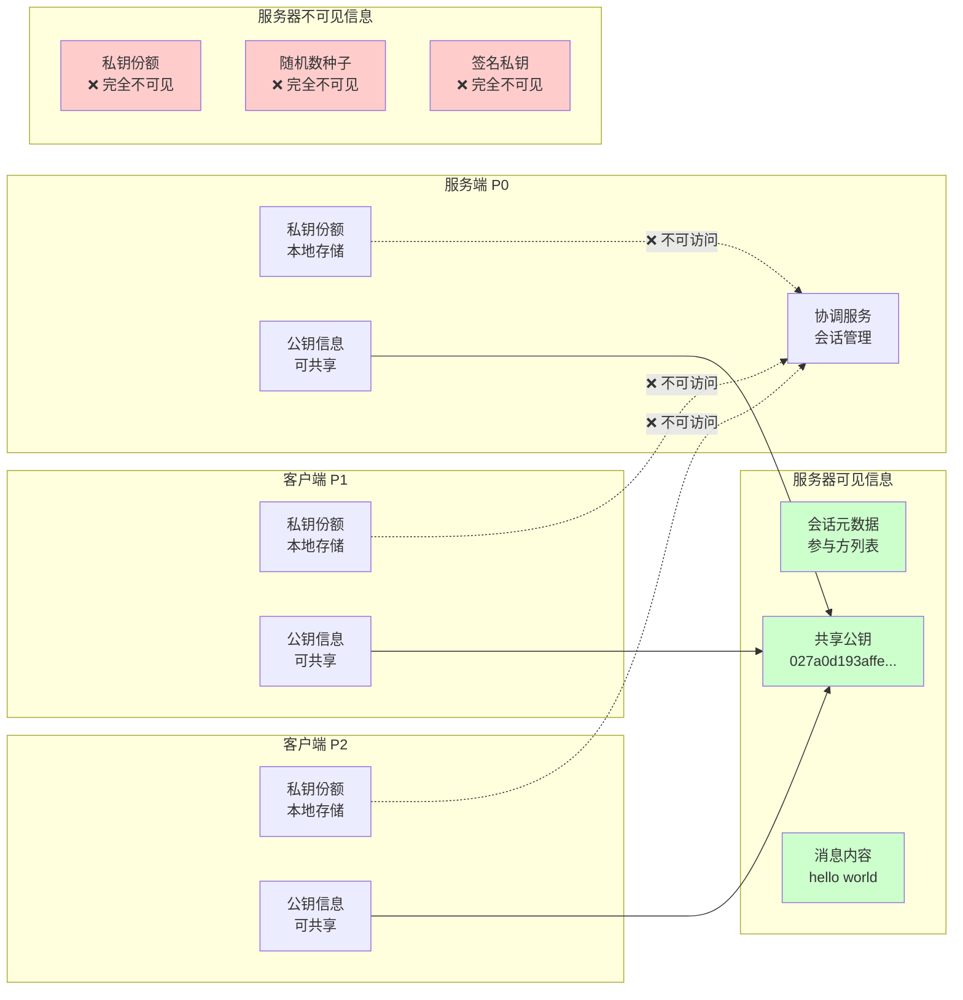
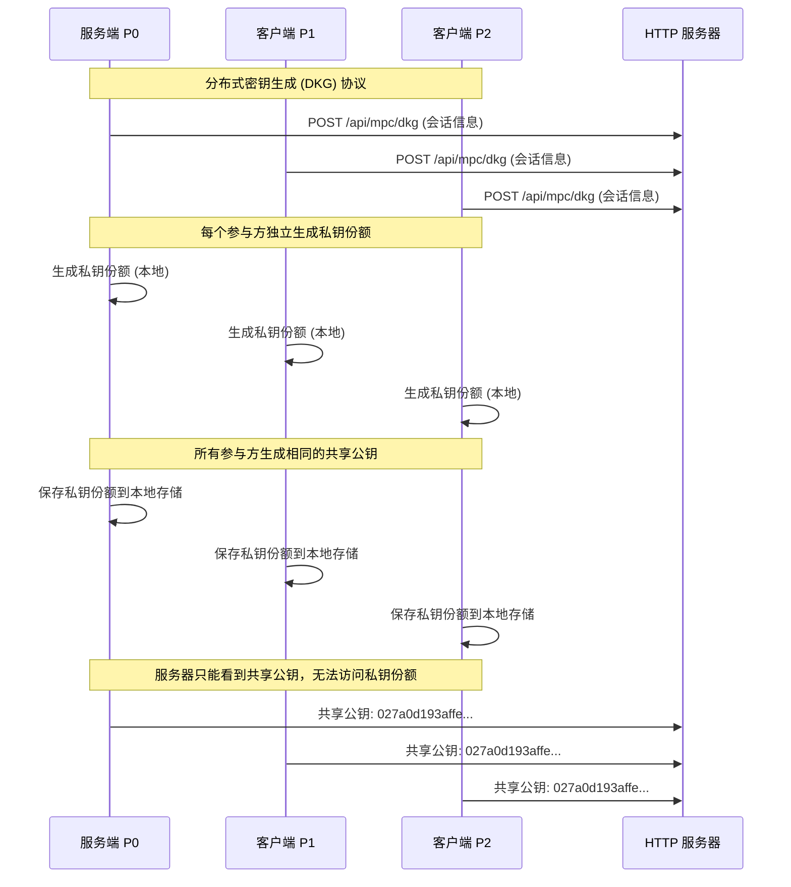
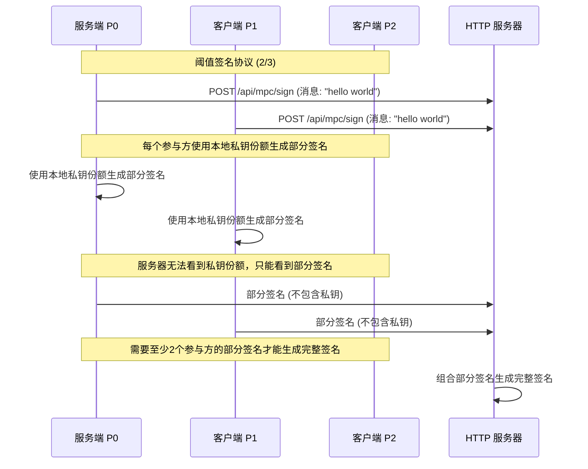
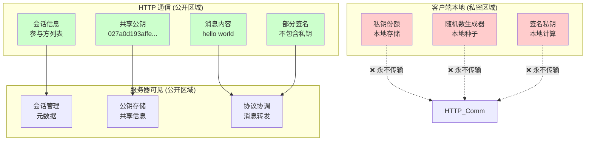
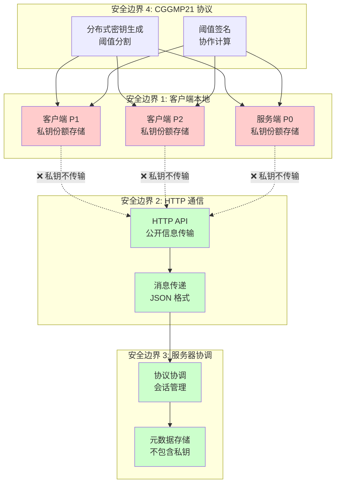

# MPC Server-Client 架构图

## 🔒 系统架构与隐私保护

### 1. 整体架构图

### 2. 隐私保护机制图

### 3. DKG 协议流程图

### 4. 阈值签名流程图

### 5. 数据流隐私保护图

### 6. 安全边界图

## 🔒 隐私保护总结

### ✅ **服务器无法获取的信息**：
- **私钥份额** - 每个客户端的私钥份额只存储在本地
- **随机数种子** - 每个参与方的随机数生成器是独立的
- **签名私钥** - 签名过程中私钥始终在本地
- **完整私钥** - 任何单个参与方都无法获得完整私钥

### ✅ **服务器只能看到的信息**：
- **会话元数据** - 会话ID、参与方列表、阈值等
- **共享公钥** - 所有参与方都知道的公钥
- **消息内容** - 要签名的消息
- **部分签名** - 已经生成的部分签名

### 🎯 **隐私保护机制**：
1. **本地存储** - 所有私钥信息只存储在客户端本地
2. **阈值分割** - 私钥被分割成多个份额，单个份额无意义
3. **协作签名** - 需要多个参与方合作才能生成有效签名
4. **协议隔离** - 服务器只负责协调，不参与私钥操作 